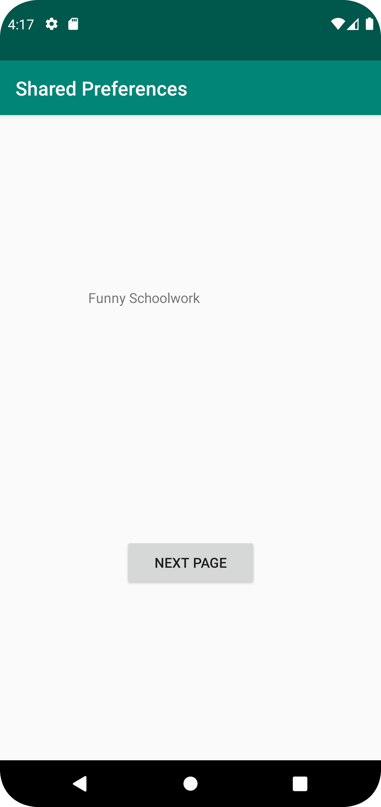

# Assignment 6: Shared preferences
## Read data and show shared data from SecondActivity in MainActivity

## SecondActivity that can be opened from MainActivity

## Data to Shared Preferences using EditText


## Code Examples
**Read Data**
```java
public class MainActivity extends AppCompatActivity {
    private SharedPreferences myPreferenceRef;
    private SharedPreferences.Editor myPreferenceEditor;

    protected void onCreate(Bundle savedInstanceState) {
        super.onCreate(savedInstanceState);
        myPreferenceRef = getSharedPreferences("key", MODE_PRIVATE);
        myPreferenceEditor = myPreferenceRef.edit();

        // Read a preference
        TextView prefTextRef = findViewById(R.id.EditTextDisplay);
        prefTextRef.setText(myPreferenceRef.getString("key", "No pref found."));
    }
}
```
_(onCreate)_
            
```java
public class MainActivity extends AppCompatActivity {
    @Override
    protected void onResume() {
        super.onResume();
        TextView sharedPrefData = findViewById(R.id.EditTextDisplay);
        sharedPrefData.setText(myPreferenceRef.getString("key", "Name"));
    }
}
```
_(onResume)_

**Open SecondActivity**
```java
public class MainActivity extends AppCompatActivity {
    protected void onCreate(Bundle savedInstanceState) {

        Button submit = findViewById(R.id.NextPage);
        submit.setOnClickListener(new View.OnClickListener() {
            @Override
            public void onClick(View view) {
                Intent intent = new Intent(MainActivity.this, SecondActivity.class);
                startActivity(intent);
            }
        });
    }
}
```
_Navigation Button_

**Data to Shared Preferences**
```java
public class SecondActivity extends AppCompatActivity {
    protected void onCreate(Bundle savedInstanceState) {
        super.onCreate(savedInstanceState);
        Button button = findViewById(R.id.SaveButton);
        button.setOnClickListener(new View.OnClickListener() {
            @Override
            public void onClick(View view) {
                save();
            }
        });
    }
}
```
_(Button To call save();)_

```java
public class SecondActivity extends AppCompatActivity {
    void save() {
        EditText sharedPrefData = findViewById(R.id.editText);
        myPreferenceEditor.putString("key", sharedPrefData.getText().toString());
        myPreferenceEditor.apply();
    }
}
```
_(Save Function)_

## Pictures

_activity_second.xml_


_activity_main.xml_
